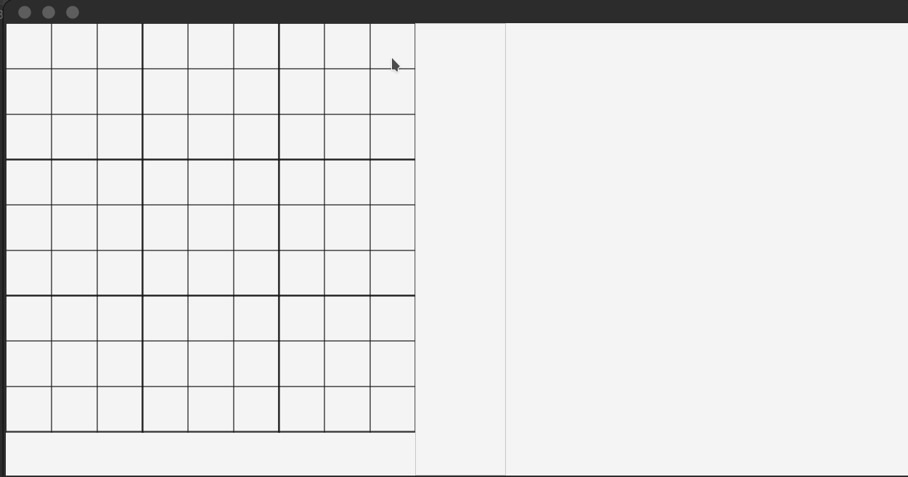

# Tic_Tac_Toe

## Brief
Project created during Object Oriented Programming course. Simple game - advanced version of tic-tac-toe.

More information can be found here: https://github.com/apohllo/obiektowe-lab/blob/master/proj2/Ultimate_Tic_Tac_Toe.md

## Description

1. This is a 1 vs 1 multiplayer game.
2. The board consists of 9 traditional tic-tac-toe boards.
3. The player who succeeds in placing three of their big marks in a horizontal, vertical, or diagonal row is the winner.
4. In order to place a big mark you need to win in a single board.
5. The tile you choose decides in which board your enemy will have to place his mark.
6. If chosen board has already been solved, you are free to choose your board to place the mark.

Example game:

  

